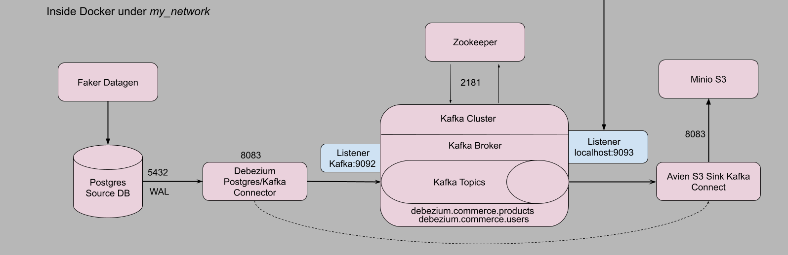

# Project - Change Capture Data with Debezium, Apache Kafka and PostgreSQL

Associated blog post for this project - https://dr563105.github.io/posts/2023-08-29-cdc-debezium-kafka-pg/


## Objective
Observe and monitor a postgres DB source with a schema `commerce` and tables `users` and `products`. When there is a change in their rows, we will capture those changed data, send it downstream through Apache Kafka and make it available for analytics through `duckDB`.

## Prerequisites and Setup

We use Ubuntu 20.04 LTS AWS EC2 machine for the project.

We need the following:
- [git version >= 2.37.1](https://github.com/git-guides/install-git),
- [Docker version >= 20.10.17](https://docs.docker.com/engine/install/) and [Docker compose v2 version >= v2.10.2](https://docs.docker.com/compose/install/),
- [pgcli](https://www.pgcli.com/install),
- [make](https://linuxhint.com/install-make-ubuntu/),
<!-- - AWS account and [awscli](https://docs.aws.amazon.com/cli/latest/userguide/getting-started-install.html) -->
- optional, python >= v3.7.

To make things easier I have scripted these prerequisites. Just clone my repo and run the instructions I provide.

```{.bash filename="clone and install prerequisites"}
sudo apt update && sudo apt install git make -y
git clone 
cd dbz-kafka-pg
make install_conda
make install_docker
source ~/.bashrc
```
Logout and log in back to the instance. To test docker if it is working, run

```{.bash filename="check if docker is installed"}
docker run --rm hello-world # should return "Hello from Docker!" without errors
```

Now we're ready to execute our project.
```{.bash filename="Executing CDC project"}
cd dbz-kafka-pg
export POSTGRES_USER=postgres
export POSTGRES_PASSWORD=postgres
export POSTGRES_DB=cdc-demo-db
export POSTGRES_HOST=postgres
export AWS_KEY_ID=minio
export AWS_SECRET_KEY=minio123
export AWS_BUCKET_NAME=commerce
make up # runs all docker containers
#wait for 60 seconds allow all containers to be up and running
make connections # setup connectors
#wait for 100-120 seconds to allow data to be pushed to Minio(S3).
```
Open a browser and go to `localhost:9001` to open up `Minio UI`. Login with `minio` as username and `minio123` as password. Then navigate to `buckets` -> `commerce` -> debezium.commerce.products` and further to get to the `json` files. Similarly to reach `debezium.commerce.users` table `json` files.

These `json` files contain the change data(Upsert and delete) for respective tables. From here we can use `duckdb` to analyse data. There you have it,  a complete data pipeline that fetches change data from the source and brings it to the sink(downstream).

### Deleting resources
To bring down all container and return to the original state, run the following instructions

```{.bash filename="restoring to original state"}
make down #shuts down all project processes and docker containers
# to delete minio buckets with json files
sudo rm -rf minio/ psql_vol/
```

## Testing

For testing a separate testing environment with each component is created. To get started, execute the following commands sequentially.

```bash
export TEST_POSTGRES_USER=test_postgres
export TEST_POSTGRES_PASSWORD=test_postgres
export TEST_POSTGRES_DB=test_cdc-demo-db
export TEST_POSTGRES_HOST=test_postgres
export TEST_DB_SCHEMA=commerce
export TEST_AWS_KEY_ID=test_minio
export TEST_AWS_SECRET_KEY=test_minio123
export TEST_AWS_BUCKET_NAME=commerce

make tsetup #tests end-to-end

make tdown #shutdown all resources
# sudo rm -rf test_minio/ test_psql_vol/
```